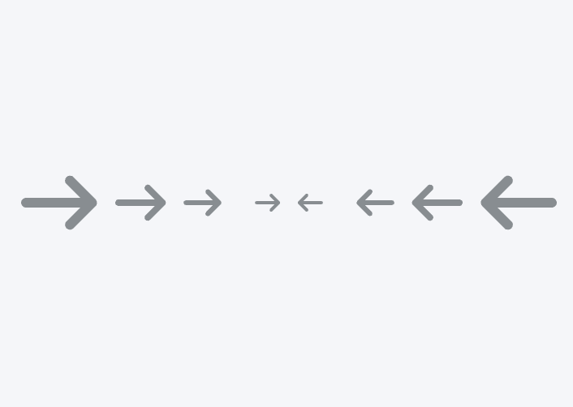

# Icon

Sample usage -

```HTML
 <div style="display: flex; gap: 10px; align-items: center; justify-content: center; margin-bottom: 20px;">
  <tu-icon></tu-icon>
  <tu-icon size="l"></tu-icon>
  <tu-icon size="m"></tu-icon>
  <tu-icon size="s"></tu-icon>
  <tu-icon size="xs"></tu-icon>
  <tu-icon size="xs" instance="left"></tu-icon>
  <tu-icon size="s" instance="left"></tu-icon>
  <tu-icon size="m" instance="left"></tu-icon>
  <tu-icon size="l" instance="left"></tu-icon>
  <tu-icon instance="left"></tu-icon>
 </div>
```

Screenshot -


